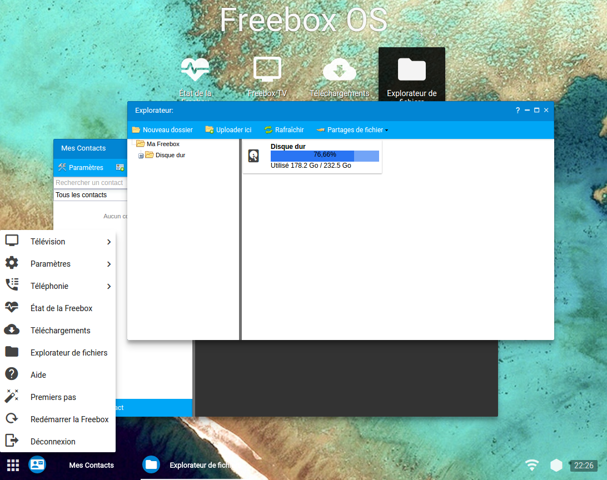

# Material-Freebox-OS

This project's aim is to redesign Freebox OS's UI by injecting custom stylesheets into its web interface via a Google Chrome
extension.

As you can see, the redesign is hugely inspired from [Google's Material design guidelines](http://www.google.com/design/spec/material-design/introduction.html)
and Chrome OS specs.

> Warning: this is not meant to be perfect. Freebox OS's UI is quite difficult to style, and some changes aren't possible for now.
I'd rather keep this project maintainable and compatible with upcoming releases of Freebox OS than doing some Javascript black
magic to set these minimize/maximize/close buttons padding.

This project is still a draft for now. Once it'll be considered stable, I'll create a Google Chrome extension.

## 3d party libraries
This project ships & relies on the following projects:

* jQuery
* [Material Design Icons](materialdesignicons.com)
* Roboto font

## How does it work?
Quite straight-forward actually: the [`content-script.js`](js/content-script.js) file is injected by Chrome inside the tab.
 His aim is to inject the necessary resources (`style.css`, `script.js`, jQuery, MaterialDesignIcons stylesheet, Roboto font).

That's it!

## Sidenotes
I'm really sorry for all these `!important` in the stylesheets. As you may know, Freebox OS use a lot of these so I had no choice.
