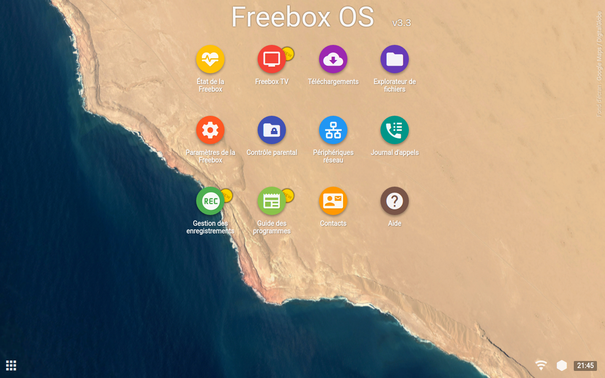
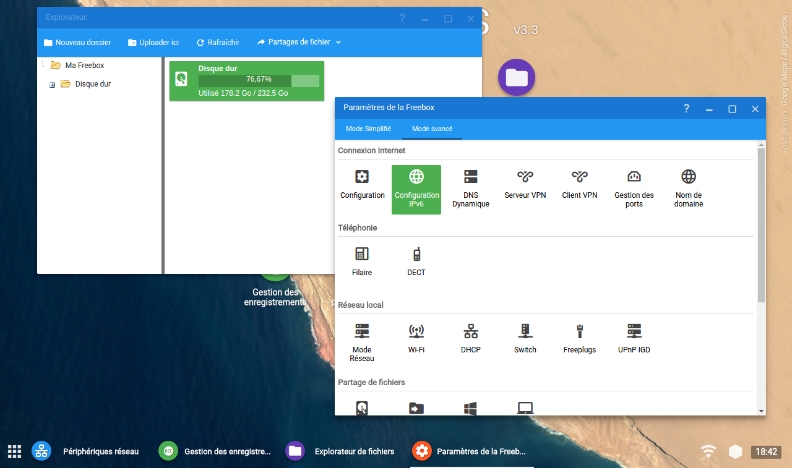

#  Material-Freebox-OS

This project's aim is to redesign Freebox OS's UI by injecting custom stylesheets into its web interface via a Google Chrome
extension.

As you can see, the redesign is hugely inspired from [Google's Material design guidelines](http://www.google.com/design/spec/material-design/introduction.html)
and Chrome OS specs.

> Warning: this is not meant to be perfect. Freebox OS's UI is quite difficult to style, and some changes aren't possible for now.
I'd rather keep this project maintainable and compatible with upcoming releases of Freebox OS than doing some Javascript black
magic to set these minimize/maximize/close buttons padding.

## [Download on Chrome Web Store](https://chrome.google.com/webstore/detail/material-freebox-os/lhdfonhgkclaigpfmclbahllambeednh)

|   |  |
|:--------------------------------------------:|:-------------------------------------------:|

This project ships & relies on the following projects:

* [Material Design Icons](https://materialdesignicons.com)
* [Roboto font](https://www.google.com/fonts/specimen/Roboto)
* Wallpaper from [Michiel van den Berg](https://www.behance.net/michiel_vandenberg)

## How does it work?
Quite straight-forward actually: the [`injecter.js`](js/injecter.js) file is injected by Chrome inside the tab.
 His aim is to inject the necessary resources - `style.css`, `script.js`, MaterialDesignIcons stylesheet and Roboto font.

That's it!

### How about security?
That's a legitimate question: you can browse both Javascript files ([`injecter.js`](js/injecter.js) and [`script.js`](js/script.js))
- in this repo or directly from Chrome's debugger tools - to see that their sole purpose is to manipulate the DOM to apply
 some styling that couldn't be set in CSS.

## How to contribute
Do not hesitate to open issues or to create pull requests against the master branch !
The main project is based on SCSS to build CSS files: you'll need an appropriate compiler alongside with some Chrome extensions notions.

> Note: we're using the EditorConfig standard to supply coding rules for this project, learn more about it [here](http://editorconfig.org/).

### Sidenotes
I'm really sorry for all these `!important` in the stylesheets. As you may know, Freebox OS use a lot of these so I had no choice.

## Licensing
Material-Freebox-OS is distributed under the GNU GPL version 2.
