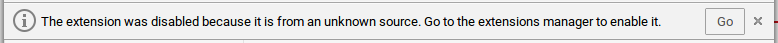
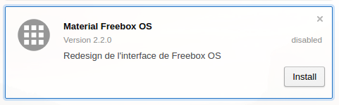

# Installing Material Freebox OS on Opera

[[FR] Installer Material Freebox OS sur Opera](opera-fr.md)

Opera allows you to install & use Google Chrome extensions. Follow these steps to install Material Freebox OS:

1. Install [Download Chrome Extension](https://addons.opera.com/fr/extensions/details/download-chrome-extension-9/)
2. Navigate to [Material Freebox OS](https://chrome.google.com/webstore/detail/material-freebox-os/lhdfonhgkclaigpfmclbahllambeednh/)
- Hit "Add to Opera"
- "*The extension was disabled because it is from an unknown source. Go to the extensions manager to enable it.*": hit "Go"

- Hit "Install"

- "*The extension "Material Freebox OS" was added from outside the official add-ons website.*": hit "Install"

That's it!
